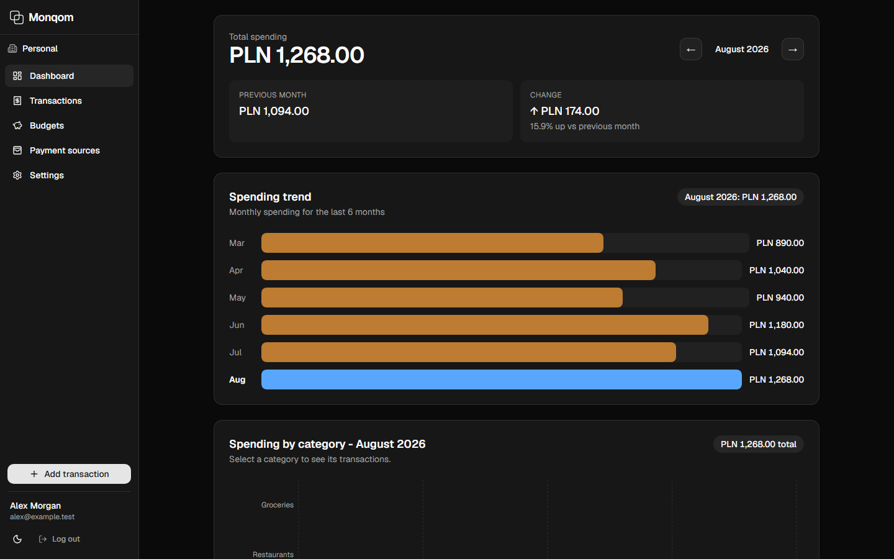
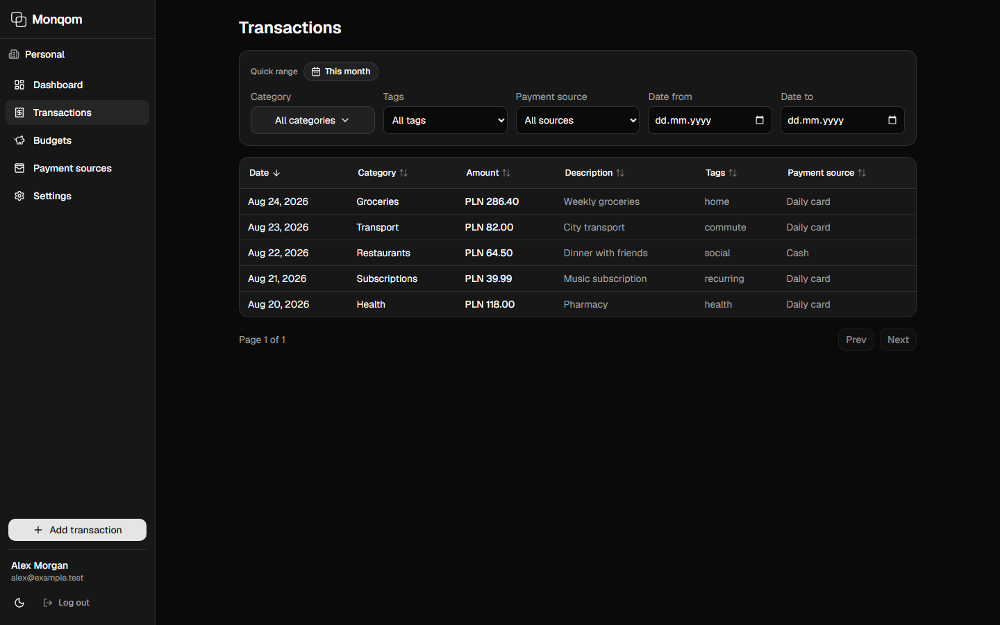
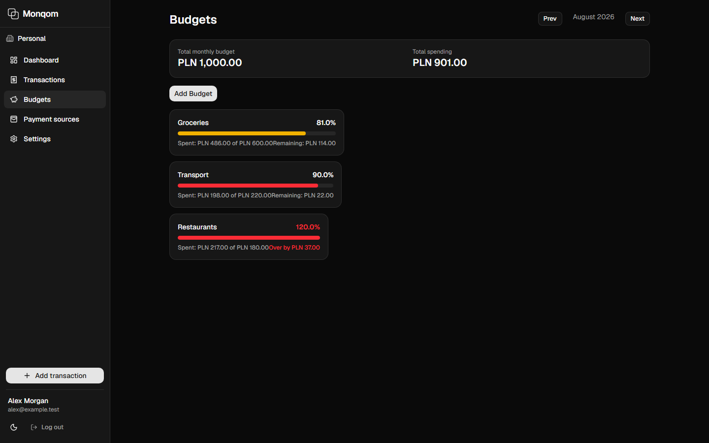
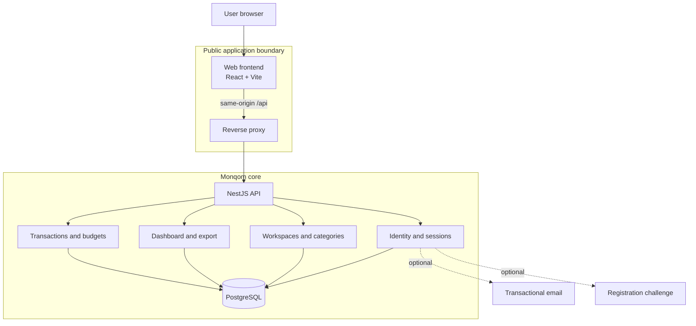
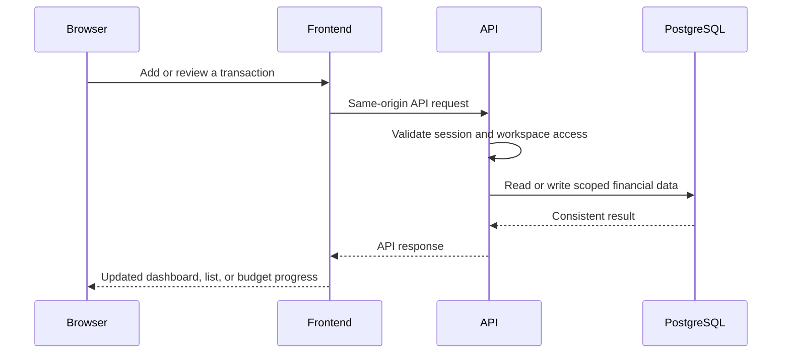

<div align="center">

# 💸 Monqom

### Personal finance, made clear.

An open-source personal-finance app for understanding everyday spending — without the weight of accounting software.

[🌐 Try Monqom](https://monqom.sergiusz.dev) · [🐳 Self-host it](docs/self-hosting.md) · [🛡️ Security](SECURITY.md) · [📜 AGPL-3.0](LICENSE)

</div>



> **See where your money goes.** Record expenses, keep them organized, follow your monthly spending, and stay close to the budgets you set.

## ✨ Why Monqom?

Personal finance should help you make sense of the month, not create more work. Monqom keeps the scope intentionally focused: everyday expenses, useful context, and a clear view of what is happening.

|     | What you get                                                                                                               |
| --- | -------------------------------------------------------------------------------------------------------------------------- |
| 📊  | **A calm monthly overview** — totals, category breakdowns, spending trends, and recent activity in one place.              |
| 🧾  | **Organized transactions** — categories, payment sources, tags, notes, search, and filters.                                |
| 🎯  | **Practical budgets** — set monthly category limits and see how close you are to each one.                                 |
| 🔐  | **Control over your data** — export transactions as CSV or JSON, use the hosted app, or run the open-source core yourself. |
| 🌗  | **Comfortable everywhere** — responsive layouts, dark and light themes, Polish and English.                                |

Monqom is not a bank, accounting system, tax tool, or financial adviser. It is a focused companion for tracking personal spending with more clarity.

## 👀 A quick tour

<div align="center">
  <h3>🧾 Keep everyday spending organized</h3>
  <p>Find the detail behind each expense with filters, categories, payment sources, and tags.</p>
  
</div>

<div align="center">
  <h3>🎯 See where each budget stands</h3>
  <p>Give categories a monthly boundary and spot what needs attention before the month ends.</p>
  
</div>

<sub>All values and names shown above are fictional, deterministic presentation data.</sub>

## 🧭 Choose how you use it

- **Hosted:** create an account at [monqom.sergiusz.dev](https://monqom.sergiusz.dev) and start tracking.
- **Self-hosted:** run the open-source core with Docker and PostgreSQL on infrastructure you control. See the [self-hosting guide](docs/self-hosting.md).

The core product works the same in both cases; the difference is who operates the infrastructure.

## 🏗️ How it is built

Monqom is a modular monolith: one backend with clearly separated financial domains. It is straightforward to run locally or self-host, without making a personal-finance app needlessly distributed.



Every financial operation is scoped to a workspace before it reaches PostgreSQL. Email delivery and registration protection are optional integrations, not dependencies of the financial core.

<details>
<summary><strong>🔄 See a typical request flow</strong></summary>



</details>

## 🛠️ Tech stack

- **Frontend:** React, TypeScript, Vite, Tailwind CSS
- **Backend:** NestJS, Prisma, PostgreSQL
- **Quality:** Playwright, Vitest, Jest
- **Deployment:** Docker

## 🚀 Run locally

Start the local frontend, backend, and PostgreSQL stack:

```bash
docker compose -f docker-compose.dev.yml up --build
```

Open the app at `http://localhost:5173`. The API is available at `http://localhost:3000`, its health check is at `http://localhost:3000/health`, and PostgreSQL listens on `localhost:5432`.

Stop the stack when you are finished:

```bash
docker compose -f docker-compose.dev.yml down
```

Need production-oriented configuration? Read the [self-hosting guide](docs/self-hosting.md).

## 📸 Recreate the presentation screenshots

The screenshots use Playwright API fixtures only. They never call a real account, database, or hosted service.

```powershell
$env:MARKETING_SCREENSHOTS='1'
pnpm --filter frontend run test:e2e -- --grep='@marketing'
```

## 🤝 Contributing and releases

Read [CONTRIBUTING.md](CONTRIBUTING.md), [SECURITY.md](SECURITY.md), and the [release policy](docs/releases.md) before contributing or deploying.

<div align="center">

Made for a clearer view of everyday money. · Licensed under [AGPL-3.0](LICENSE).

</div>
